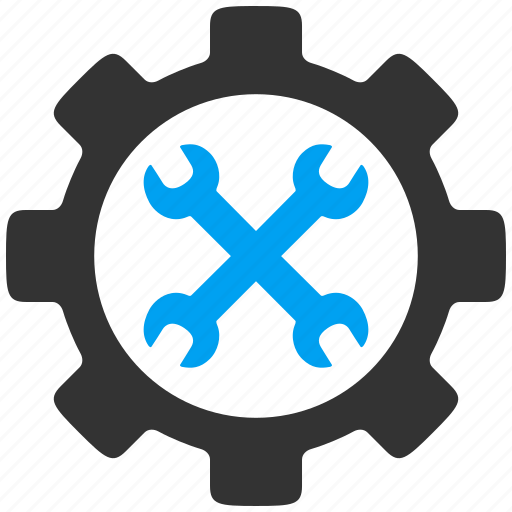

# Developer Utilities
<p align="center">
    
</p>

Welcome to the Developer Utilities repository! This collection of developer tools and utilities is designed to make your software development journey more efficient and productive. Whether you're a beginner or an experienced developer, these utilities can help you streamline common tasks, automate workflows, and improve your coding experience.

## Table of Contents

- [Getting Started](#getting-started)
- [Tools and Utilities](#tools-and-utilities)
- [Contributing](#contributing)
- [Public domain](#public-domain)
- [Contact](#contact)

## Getting Started

To get started with the Developer Utilities, follow these simple steps:

1. **Clone the Repository**: First, clone this repository to your local machine:

   ```bash
   git clone https://github.com/USDOT-SDC/dev-utils.git
   ```

2. **Choose a Utility**: Navigate to the utility or tool you want to use in the repository. Each utility is located in its own directory with its own README and usage instructions.

3. **Install Dependencies**: If the utility requires any dependencies, follow the installation instructions provided in the utility's README.

4. **Run the Utility**: Execute the utility according to the provided usage instructions.

5. **Contribute**: If you have ideas for improvements or want to contribute a new utility, check out the [Contributing](#contributing) section below.

## Tools and Utilities

### AWS Network Interface Query

The AWS Network Interface Query tool is a script that queries AWS network interfaces in your Amazon Web Services (AWS) environments.

- [AWS Network Interface Query README](aws-net-if-query/README.md)

## Contributing

We welcome contributions from the developer community! If you have ideas for new utilities, improvements to existing ones, or bug fixes, please check out our [contribution guidelines](CONTRIBUTING.md) for more information on how to get involved.

## Public domain
This project is in the worldwide [public domain](LICENSE.md). As stated in [CONTRIBUTING](CONTRIBUTING.md):

> This project is in the public domain within the United States, and copyright and related rights in the work worldwide are waived through the [CC0 1.0 Universal public domain dedication](https://creativecommons.org/publicdomain/zero/1.0/).
>
> All contributions to this project will be released under the CC0 dedication. By submitting a pull request, you are agreeing to comply with this waiver of copyright interest.

## Contact

If you have any questions, suggestions, or issues related to the Developer Utilities, please [open an issue](https://github.com/USDOT-SDC/dev-utils/issues) on our GitHub repository.

For general inquiries and support, you can reach out to us at [sdc-admins@dot.gov](mailto:sdc-admins@dot.gov).

Thank you for using Developer Utilities to enhance your development workflow! We hope these tools make your coding experience more enjoyable and productive.
